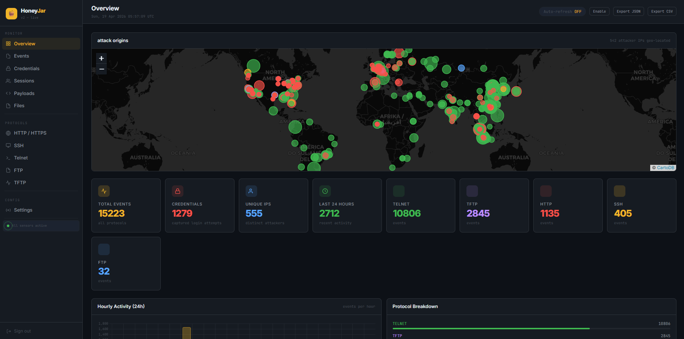

# HoneyJar v2



Honeypot lab that runs entirely in Docker. One command and you're collecting — SSH, Telnet, HTTP/HTTPS, FTP, and TFTP all listening at once, everything going into a Postgres database, live dashboard at localhost:5000. No config files to write by hand, no systemd nonsense, no manual database setup. The script handles all of it.

Every honeypot supports multiple ports per protocol. You can run SSH on 22 and 2222 at the same time, FTP on 21 and 2121, TFTP on 69 and 6969 — whatever you want. Change it in one JSON file and it picks up the new ports without rebuilding anything.

---

## What gets logged

**SSH / Telnet** — Cowrie handles these. Every login attempt goes in the database with the username and password. If someone actually gets a shell, every command they type gets logged. None of it executes on the real host — Cowrie gives them a fake filesystem and fake responses.

**HTTP / HTTPS** — full request logging: method, path, headers, body, user agent. The honeypot serves fake pages that look like real targets — WordPress login, phpMyAdmin, `.env` endpoints, admin panels. Scanners see something they recognize and start submitting credentials. All of that goes straight to the dashboard.

**FTP** — accepts every login, shows a fake filesystem full of things that look worth stealing (`db_backup_2024.sql.gz`, `credentials.txt`, SSH keys). Every command, download attempt, and file upload is captured. The files exist purely to bait automated downloaders.

**TFTP** — responds to read and write requests with fake router configs and firmware images. A lot of automated scripts scan for TFTP specifically to grab Cisco configs — this gives them something to find while logging everything they do.

---

## Running it

Needs Docker with the compose plugin and Python 3.8+. Run as root if you want iptables blocking to work (more on that below).

```bash
git clone https://github.com/nick-pyc/HoneyJar-V2
cd HoneyJar-V2
python3 HoneyJarV2.py
```

Dashboard is at `http://localhost:5000`. The access key and owner key print to the terminal on first run. Before putting this on anything internet-facing, change `ACCESS_KEY` and `OWNER_KEY` at the top of `HoneyJarV2.py`.

---

## Ports

| Service   | Default | Protocol |
|-----------|---------|----------|
| SSH       | 2222    | TCP      |
| Telnet    | 23      | TCP      |
| HTTP      | 8080    | TCP      |
| HTTPS     | 8443    | TLS      |
| FTP       | 21      | TCP      |
| TFTP      | 69      | UDP      |
| Dashboard | 5000    | TCP      |

To add more ports for any protocol, edit `cowrie/etc/ports_config.json` directly — the honeypots pick it up without a restart. Or change `DEFAULT_PORTS` in `HoneyJarV2.py` before the first run:

```json
{
  "ssh":    [2222, 2223],
  "telnet": [23, 2323],
  "http":   [8080, 8888],
  "https":  [8443],
  "ftp":    [21, 2121],
  "tftp":   [69, 6969]
}
```

HTTP has a hot-reload watcher so new ports show up within about 5 seconds. SSH and Telnet restart the Cowrie container to apply port changes.

---

## Dashboard

- **Overview** — attack map, hourly chart, top attacker IPs, top credential combos, recent events feed
- **Events** — full event log, filterable by protocol / type / IP / date range, exportable as JSON, CSV, or TXT
- **Credentials** — every username:password pair captured across all protocols. Filter, export as a wordlist, copy individual combos
- **Sessions** — attackers grouped by IP and protocol. Click any row to see a full timeline of everything they did in that session
- **Payloads** — commands, uploaded files, HTTP POST bodies. Has a hex viewer for anything binary
- **Protocol pages** — dedicated view for each protocol with its own stats and event table
- **Settings** — port editor, blocked IP list, export links (owner key required)

Every IP, credential, command, and path has a copy button.

### Auth

Two keys:

- **Access key** — gets you into the dashboard
- **Owner key** — unlocks Settings, asked separately even when you're already logged in

Both are set in `HoneyJarV2.py` and passed into the container as environment variables. Never stored in the database.

---

## IP blocking

The orchestrator puts a bash watcher at `/usr/local/bin/honeyjar2-block-watcher.sh`. It checks `blocked_ips.txt` every few seconds and keeps a `HONEYJAR2` iptables chain in sync. Block an IP from the dashboard and it's dropped at the kernel level within seconds. Requires root — if you're not running as root it just skips silently and everything else still works.

---

## Project layout

```
HoneyJar-V2/
├── HoneyJarV2.py
├── cowrie/
│   └── etc/
│       ├── cowrie.cfg
│       ├── userdb.txt
│       ├── ports_config.json    ← edit this to change ports at runtime
│       └── blocked_ips.txt      ← written by dashboard, read by block watcher
├── dashboard/
│   ├── app.py
│   ├── Dockerfile
│   ├── static/
│   │   ├── favicon.svg
│   │   └── preview.png
│   └── templates/
├── http_honeypot/
├── ftp_honeypot/
├── tftp_honeypot/
└── cowrie_watcher/
```

---

## A few things worth knowing

Don't expose port 5000 to the internet. Put it behind a VPN or a firewall rule. The honeypot ports are supposed to be reachable — that's the whole point — but the dashboard shouldn't be.

The FTP fake filesystem is designed to look like a compromised server that someone forgot to lock down. Files like `credentials.txt` and `id_rsa` are there specifically because automated tools will try to download anything with those names.

TFTP serves fake Cisco/router configs because that's what a lot of scanning scripts are looking for. Give them something to find.

Cowrie's shell simulation is convincing enough that most attackers won't realize they're sandboxed. They'll run `uname`, `whoami`, `cat /etc/passwd`, get realistic-looking output, and keep going.

Geo lookup uses ip-api.com's free batch endpoint (45 requests/minute). Under heavy attack you'll see a short delay before new IPs show up on the map. No API key needed.

To reset everything and start fresh: `docker compose down -v` wipes the Postgres volume along with all the containers.
